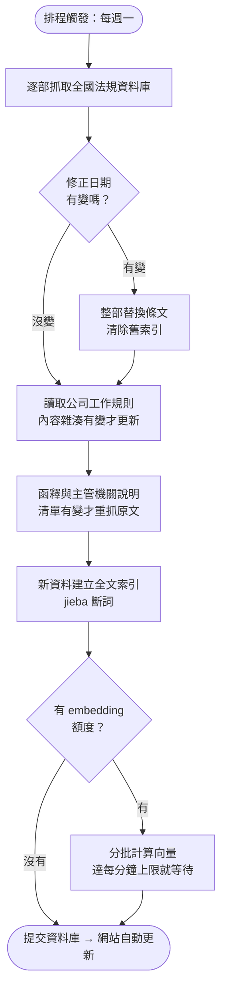
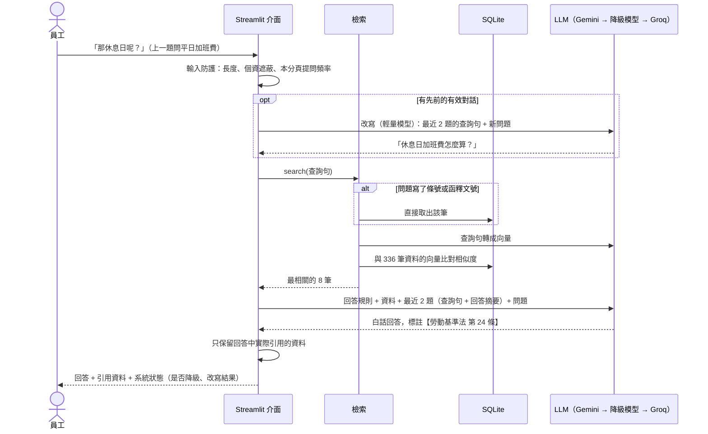

# 📘 規章與勞動法規問答助理

員工和主管用口語提問，例如「做滿一年可以放幾天特休？」「公司說加班只能換補休，合法嗎？」。
系統會從**公司工作規則、勞動法規、勞動部函釋與主管機關說明**找出依據，用白話回答並附上出處；
遇到公司規章比法規更不利於員工時，會直接指出來。支援追問（「那休息日呢？」）。

**線上展示：**（部署後補上）

> 本專案的公司工作規則為**虛構範例**（`data/handbook.md`）；法規來自[全國法規資料庫](https://law.moj.gov.tw/)，
> 函釋來自[勞動部勞動法令查詢系統](https://laws.mol.gov.tw/)。

## 解決什麼問題

### 沒有這個工具時

公司裡關於請假、加班、特休的問題，每天都在發生，而且大多是**重複的問題**：

| 誰 | 遇到的狀況 | 通常怎麼處理 | 問題在哪 |
|---|---|---|---|
| **員工** | 想知道特休剩幾天、家人住院能請什麼假、離職要提前多久講 | 翻員工手冊（找不到或看不懂），或直接問人資 | 手冊用語生硬；不好意思一直問；問同事得到的答案常常是錯的 |
| **人資／行政** | 每天被問同樣的問題 | 一個一個回答，遇到不確定的再去查法條 | 時間被切碎；不同人回答口徑不一；新人要花很久才熟悉法規 |
| **主管** | 部屬要請假或加班，要判斷能不能准、怎麼給 | 憑經驗判斷，或轉問人資 | 判斷錯誤可能讓公司違法（例如強制加班只能換補休） |
| **公司** | 工作規則多年沒有檢視 | 沒人發現某些條文已經跟不上修法 | 勞檢時才發現違法，面臨罰鍰 |

### 使用這個工具後

| 誰 | 怎麼用 | 效益 |
|---|---|---|
| **員工** | 直接用口語提問，幾秒拿到白話回答與條文出處 | 不用翻手冊、不用等人資回覆，隨時可查 |
| **人資／行政** | 常見問題請員工先問系統；自己查法條時也用它快速找到條號 | 重複問題減少，時間留給需要判斷的個案；回答口徑一致 |
| **主管** | 准假、排加班前先查一下規定 | 減少誤判，降低公司違法風險 |
| **公司** | 系統會主動指出工作規則與法規衝突之處 | 在勞檢之前先發現問題（範例中的第 7 條「加班一律補休」就會被指出違反勞基法第 32-1 條） |

> 以上是依一般企業人資作業推論的效益。實際導入時，應先統計人資每月被詢問的問題類型與次數，作為導入前後比較的基準。

## 功能

| 頁面（頂端切換） | 內容 |
|---|---|
| 💬 問答 | 一般聊天 AI 的版面：輸入框固定在畫面底部，空白對話時顯示範例問題。口語提問 → 白話回答 + 引用資料（可展開看原文），等待時即時顯示各階段讀秒。可以追問；資料只能回答一部分時，先回答能確定的部分並標明不確定之處；完全查不到就直說，不會編造 |
| 📚 條文與函釋 | 依來源瀏覽法規、函釋、主管機關說明與工作規則，可用關鍵字篩選；並顯示各來源的版本（修正日期） |

介面刻意只保留這兩個功能，讓作品聚焦在「規章問答」。早期版本另有特休／加班費試算與後台資料狀態頁，評估後移除（資料狀態可用 `python -m workrules status` 查看）。

收錄範圍：

- **法規**（290 條）：勞動基準法、勞動基準法施行細則、勞工請假規則、性別平等工作法、勞工退休金條例
- **勞動部函釋**（精選 20 則）：條文沒寫清楚、實務上常被問的問題，例如月薪制的「1 日工資」怎麼算、颱風天未出勤能不能扣全勤、遲到能不能強制請事假
- **主管機關說明**（1 篇）：臺北市勞動局對「月中到職、離職的薪資怎麼算」的說明
- **公司工作規則**（21 條，虛構範例）

### 為什麼要收錄函釋與主管機關說明

測試時有一題「月薪三萬、月中離職，排休日要不要算薪水？」答不出來。檢查後發現**檢索沒有問題，而是答案根本不在法條裡**：
破月薪資的「1 日工資」算法寫在勞動部函釋，「在職天數包含排休日」寫在勞動局的說明文章。補上這兩類資料後，三種情境都能算出正確金額。

**函釋怎麼挑的**：先針對 20 個常見主題（特休、補休、病假、全勤、颱風、離職預告、扣薪…），
在勞動部勞動法令查詢系統各取最新的 12 則，共約 150 則候選；再依三個標準挑出 20 則（清單見 `data/interpretations.json`）：

1. **員工或人資會問的問題**：排除就業保險、外籍勞工、職災保險、疫情期間等特殊情境
2. **適用一般企業**：排除只針對特定行業的解釋，除非內容具一般性
3. **仍然有效**：優先選 2018 年勞基法修正後的解釋

系統只存「文號清單」與「文章網址清單」，原文一律從官方網站抓取，避免收錄到轉述錯誤的版本。

## 架構

### 資料更新流程（活動圖）



### 問答流程（循序圖）



多輪對話的資料管理規則見[設計文件](docs/design-multiturn.md)。

## 檢索品質評估

RAG 的回答品質主要取決於檢索：條文沒被找到，LLM 再強也答不對。
我準備了 26 題**員工口語提問**（18 題法規、8 題需要函釋或說明），每題標註應該找到的資料（`data/eval_set.json`），比較不同檢索方式：

| 檢索方式 | 前 3 筆命中 | 前 8 筆命中 | MRR |
|---|---|---|---|
| 只用關鍵字（BM25） | 62% | 69% | 0.53 |
| 只用語意向量 | 100% | 100% | 0.91 |
| 混合（關鍵字 + 向量，RRF） | 88% | 92% | 0.77 |
| **本系統**（條號直達 + 向量，失敗時退回關鍵字） | **100%** | **100%** | **0.91** |

另外 9 題**多輪追問**（`data/eval_multiturn.json`），例如先問「平日加班費怎麼算？」再問「那休息日呢？」：

| 方式 | 前 3 筆命中 | 前 8 筆命中 |
|---|---|---|
| 只用最後一句檢索（改寫前） | 67% | 78% |
| **先改寫成獨立問題再檢索**（本系統） | **89%** | **100%** |

其中一題刻意換話題（先問加班費，再問婚假），確認改寫不會把前後兩個話題混在一起。

重現：`uv run python -m workrules eval`

**從評估得到的設計決策：**

1. **關鍵字檢索不適合員工的口語提問**：員工問「特休」，條文寫「特別休假」；問「資遣可以拿多少錢」，條文寫「資遣費由雇主按其工作年資…」。用詞對不上，就找不到
2. **原本採用的混合檢索被評估推翻**：混合檢索是業界常見的建議做法，但在這批資料上，關鍵字結果多半是雜訊，混進來反而把正確條文擠下去。實驗把關鍵字權重從 1.0 逐步降到 0，命中率一路上升，所以改成以向量為主
3. **關鍵字仍然保留**：問題直接寫出條號時直接取該條；向量服務額度用完時退回關鍵字檢索，確保系統不會完全無法使用
4. **查詢改寫只用在追問**：單一問題整段算向量就已經 100% 命中，沒有證據需要改寫，所以第一題不改寫，不增加成本；只有追問時才改寫

> 評估題目規模不大；新增題目只要編輯 `data/eval_set.json` 或 `data/eval_multiturn.json`。

## 其他設計決策

| 決策 | 理由 |
|---|---|
| **一條條文一個檢索單位** | 法規本來就是以「條」組織，照條切比固定字數切更完整，引用時也能精確到條號 |
| **每條都帶上法規名稱與章名** | 條文常寫「前項規定…」，單看內容不知道出自哪部法規 |
| **工作規則不利於勞工時要明確指出** | 依勞基法第 1 條，雇主所訂勞動條件不得低於本法最低標準。這是公司導入內部問答工具時最有價值的副產品：主動發現規章問題 |
| **依修正日期決定是否重抓法規** | 法規很少修正，每次全部重抓浪費資源；修正時整部替換，避免逐條比對出錯 |
| **多模型、多供應商自動切換** | 使用免費 API，隨時可能遇到額度用完或服務忙碌 |
| **即時顯示各工作階段與讀秒** | 免費 API 偶爾很慢；畫面逐一顯示「理解問題 → 查詢資料 → 產生回答（使用的模型）」與秒數，主模型逾時改用備用模型也看得到，使用者不會以為系統當機 |
| **回答用串流，逾時分兩段判斷** | 非串流要等整段寫完才回傳，「沒有回應」和「回答比較長」分不出來。改用串流：第一個字 25 秒內沒出現才算沒回應（實測完整版模型會先思考約 10 秒），之後只要片段持續回來就不算逾時，另設 90 秒總上限。回答也會一邊生成一邊顯示 |
| **模型失敗後暫時跳過** | 主模型逾時或忙碌時，同一個 session 接下來 5 分鐘直接用備用模型，不必每題重新等一次逾時 |
| **主模型指定穩定版本** | 「最新版」別名在免費方案最容易塞車（實測最新版逾時、前一兩版只要 4~6 秒）；版本被停用時會立刻回 404，依序嘗試機制馬上換下一個 |
| **API 狀態直接顯示在回答上** | 這是 demo，額度用完、伺服器忙碌、改用備用模型時，畫面都會說明原因與等待時間，不會只顯示錯誤碼 |
| **資料不完整時先回答能確定的部分** | 早期規則「不確定就不回答」讓 AI 整題放棄；改為能算的先算，不確定的列出各種解讀，資料已有評價（如「有違法疑慮」）的算法作為主要結論 |
| **對話紀錄只帶最近 2 題的摘要** | 每輪都附上全部對話，成本會隨輪數平方成長；只帶最近 2 題的查詢句與回答摘要，每輪成本固定 |
| **只管理單一 session 的狀態** | demo 以單人試用為主，不設計跨使用者的共用狀態，避免非預期行為 |
| **個資在最前面遮蔽** | 免費版 Gemini 的資料可能被用於改進產品，身分證、手機、Email 在送出前就遮蔽 |
| **不另外架向量資料庫** | 資料只有 336 筆，用 numpy 全部算一遍不到幾毫秒 |

## 快速開始

需要 [uv](https://docs.astral.sh/uv/)。

```bash
uv sync
cp .env.example .env                  # 填入 GEMINI_API_KEY（免費申請：https://aistudio.google.com/apikey）
uv run python -m workrules update     # 抓取法規、函釋、說明並建立索引（首次約 5 分鐘，受免費額度限制）
uv run streamlit run app.py           # 啟動網頁介面，再用瀏覽器打開 http://localhost:8501
```

其他指令：

```bash
uv run python -m workrules ask "家人住院需要照顧，可以請什麼假？"
uv run python -m workrules eval       # 檢索品質評估
uv run python -m workrules status     # 收錄範圍與執行紀錄
uv run pytest                         # 單元測試
```

## 文件

- [操作說明](docs/operation.md)：給員工與主管
- [測試紀錄](docs/test-log.md)
- [錯誤紀錄](docs/error-log.md)：開發過程中遇到的問題與解法
- [交接文件](docs/handover.md)：專案結構、如何替換成貴公司的工作規則、如何新增法規
- [設計文件：多輪對話與輸入防護](docs/design-multiturn.md)

## 已知限制

- 只收錄 5 部法規與精選 20 則函釋、1 篇主管機關說明；判決不在範圍內
- 回答僅供參考，不構成法律意見
- 免費 embedding 額度為每分鐘 100 筆，首次建立索引需分批等待
- 追問只參考最近 2 題；重新整理頁面會清空對話
- LLM 每次生成的內容會有差異，偶爾有冗長或筆誤；目前的評估只檢查「有沒有找到正確資料」，尚未自動檢查回答內容
