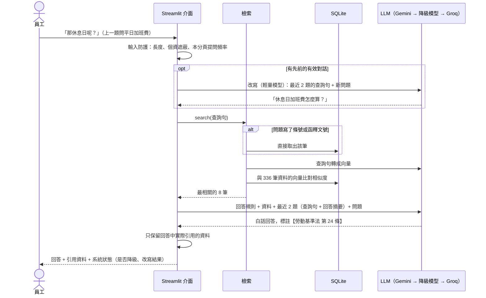

# 📘 規章與勞動法規問答助理

員工和主管用口語提問，例如「做滿一年可以放幾天特休？」「公司說加班只能換補休，合法嗎？」。
系統會從**公司工作規則、勞動法規、勞動部函釋與主管機關說明**找出依據，用白話回答並附上出處；
遇到公司規章比法規更不利於員工時，會直接指出來。支援追問（「那休息日呢？」）。

**線上展示：** https://workrules.streamlit.app （使用 Google Gemini 免費方案；閒置一段時間後首次開啟需等待約 30 秒喚醒）

> 本專案的公司工作規則為**虛構範例**（`data/handbook.md`）；法規來自[全國法規資料庫](https://law.moj.gov.tw/)，
> 函釋來自[勞動部勞動法令查詢系統](https://laws.mol.gov.tw/)。

## 目錄

1. [需求與解法](#需求與解法)
2. [功能](#功能)
3. [技術棧](#技術棧)
4. [技術選型的理由](#技術選型的理由)
5. [架構](#架構)
6. [檢索品質評估](#檢索品質評估)
7. [開發歷程：遇到的問題與設計決策](#開發歷程遇到的問題與設計決策)
8. [設計決策一覽](#設計決策一覽)
9. [技術問答](#技術問答)
10. [快速開始](#快速開始)

## 需求與解法

### 需求

公司裡關於請假、加班、特休、離職的問題每天都在發生，而且大多重複：

- **員工**：員工手冊看不懂、找不到，問同事又常得到錯的答案
- **人資**：一直被問同樣的問題，時間被切碎，不同人回答的口徑也不一致
- **公司**：工作規則多年沒檢視，跟不上修法，要等到勞檢才發現違法

### 這個工具怎麼解決

- **附上出處**：每個結論都標明依據哪一條，點開就能看原文，不用憑感覺相信 AI
- **查不到就直說**：資料裡沒有的內容不編造；只能回答一部分時，先回答能確定的部分，再標明哪裡不確定
- **主動指出規章違法**：公司規定比法律更不利於員工時，會直接指出來
- **可以追問**：問完平日加班費，接著問「那休息日呢？」，系統知道你在問什麼

> 建議試試：「公司說加班只能換補休不能領錢，這樣合法嗎？」範例工作規則第 7 條就是這樣寫的，系統會指出它違反勞基法第 32-1 條。

### 導入前後的效益

**沒有這個工具時：**

| 誰 | 遇到的狀況 | 通常怎麼處理 | 問題在哪 |
|---|---|---|---|
| **員工** | 想知道特休剩幾天、家人住院能請什麼假、離職要提前多久講 | 翻員工手冊（找不到或看不懂），或直接問人資 | 手冊用語生硬；不好意思一直問；問同事得到的答案常常是錯的 |
| **人資／行政** | 每天被問同樣的問題 | 一個一個回答，遇到不確定的再去查法條 | 時間被切碎；不同人回答口徑不一；新人要花很久才熟悉法規 |
| **主管** | 部屬要請假或加班，要判斷能不能准、怎麼給 | 憑經驗判斷，或轉問人資 | 判斷錯誤可能讓公司違法（例如強制加班只能換補休） |
| **公司** | 工作規則多年沒有檢視 | 沒人發現某些條文已經跟不上修法 | 勞檢時才發現違法，面臨罰鍰 |

**使用這個工具後：**

| 誰 | 怎麼用 | 效益 |
|---|---|---|
| **員工** | 直接用口語提問，幾秒拿到白話回答與條文出處 | 不用翻手冊、不用等人資回覆，隨時可查 |
| **人資／行政** | 常見問題請員工先問系統；自己查法條時也用它快速找到條號 | 重複問題減少，時間留給需要判斷的個案；回答口徑一致 |
| **主管** | 准假、排加班前先查一下規定 | 減少誤判，降低公司違法風險 |
| **公司** | 系統會主動指出工作規則與法規衝突之處 | 在勞檢之前先發現問題 |

> 以上是依一般企業人資作業推論的效益。實際導入時，應先統計人資每月被詢問的問題類型與次數，作為導入前後比較的基準。

## 功能

| 頁面（頂端切換） | 內容 |
|---|---|
| 💬 問答 | 一般聊天 AI 的版面：輸入框固定在畫面底部，空白對話時顯示範例問題。口語提問 → 白話回答 + 引用資料（可展開看原文），等待時即時顯示各階段讀秒。可以追問；資料只能回答一部分時，先回答能確定的部分並標明不確定之處；完全查不到就直說，不會編造 |
| 📚 條文與函釋 | 依來源瀏覽法規、函釋、主管機關說明與工作規則，可用關鍵字篩選；並顯示各來源的版本（修正日期） |

介面刻意只保留這兩個功能，讓作品聚焦在「規章問答」。早期版本另有特休／加班費試算與後台資料狀態頁，評估後移除（資料狀態可用 `python -m workrules status` 查看）。

收錄範圍：

- **法規**（290 條）：勞動基準法、勞動基準法施行細則、勞工請假規則、性別平等工作法、勞工退休金條例
- **勞動部函釋**（精選 20 則）：條文沒寫清楚、實務上常被問的問題，例如月薪制的「1 日工資」怎麼算、颱風天未出勤能不能扣全勤、遲到能不能強制請事假
- **主管機關說明**（1 篇）：臺北市勞動局對「月中到職、離職的薪資怎麼算」的說明
- **公司工作規則**（21 條，虛構範例）

**函釋怎麼挑的**：先針對 20 個常見主題（特休、補休、病假、全勤、颱風、離職預告、扣薪…），
在勞動部勞動法令查詢系統各取最新的 12 則，共約 150 則候選；再依三個標準挑出 20 則（清單見 `data/interpretations.json`）：

1. **員工或人資會問的問題**：排除就業保險、外籍勞工、職災保險、疫情期間等特殊情境
2. **適用一般企業**：排除只針對特定行業的解釋，除非內容具一般性
3. **仍然有效**：優先選 2018 年勞基法修正後的解釋

系統只存「文號清單」與「文章網址清單」，原文一律從官方網站抓取，避免收錄到轉述錯誤的版本。

## 技術棧

| 層 | 使用技術 |
|---|---|
| 語言 | Python 3.12（套件管理：uv） |
| 介面 | Streamlit |
| 資料庫 | SQLite：條文、全文檢索索引（FTS5）、向量（BLOB 欄位）都存在同一個檔案 |
| 中文斷詞 | jieba |
| 語意檢索 | Gemini embedding（`gemini-embedding-001`）+ numpy 計算相似度 |
| 回答生成 | Gemini Flash 系列（透過 OpenAI 相容介面呼叫，可切換供應商） |
| 資料來源 | 全國法規資料庫、勞動部勞動法令查詢系統（httpx + BeautifulSoup 抓取） |
| 測試與評估 | pytest 31 項；檢索評估 26 題、多輪追問評估 9 題 |
| 自動化與部署 | GitHub Actions（每週檢查法規修正）、Streamlit Community Cloud |

## 技術選型的理由

選型原則：**這是內部小工具的規模，選最簡單、夠用、容易交接的方案**；等資料量或使用人數真的成長，再換成更重的方案。

| 選擇 | 理由 | 沒有選的方案 |
|---|---|---|
| **Python** | AI 與資料處理的套件最完整 | — |
| **Streamlit** | 用純 Python 就能做出網頁介面，不用另外寫前後端；適合內部工具快速驗證需求 | React 等前端框架：需要另寫 API，對內部工具來說成本太高 |
| **SQLite** | 一個檔案就是整個資料庫，跟著程式一起部署，不用架伺服器；內建 FTS5 全文檢索 | PostgreSQL：功能更強，但這個規模用不到，還要多維護一台伺服器 |
| **numpy 直接計算，不用向量資料庫** | 資料只有 336 筆，全部算一遍不到幾毫秒 | Chroma、pgvector 等向量資料庫：要上萬筆以上才有明顯差異，現在用只是增加複雜度 |
| **以「條」為單位切分資料** | 法規本來就以條為單位，照條切內容完整，引用也能精確到條號 | 固定字數切分：可能把一條切成兩半，或把不相關的兩條拼在一起 |
| **Gemini 免費方案** | demo 零成本；中文能力足夠；embedding 和回答模型用同一把 key | 付費 API：正式導入時可以換，程式不用改 |
| **透過 OpenAI 相容介面呼叫** | 多數 LLM 供應商都支援這個格式，換供應商只要改網址和 key；已預留 Groq 作為跨供應商備援 | 各家的專屬 SDK：換供應商要改程式 |
| **jieba 斷詞** | SQLite 內建的斷詞方式不會切中文，整句會被當成一個詞；先用 jieba 切好再存進索引 | — |

## 架構

### 資料更新流程（活動圖）


### 問答流程（循序圖）



多輪對話的資料管理規則見[設計文件](docs/design-multiturn.md)。

## 檢索品質評估

RAG 的回答品質主要取決於檢索：條文沒被找到，LLM 再強也答不對。
我準備了 26 題**員工口語提問**（18 題法規、8 題需要函釋或說明），每題標註應該找到的資料（`data/eval_set.json`），比較不同檢索方式：

| 檢索方式 | 前 3 筆命中 | 前 8 筆命中 | MRR |
|---|---|---|---|
| 只用關鍵字（BM25） | 62% | 69% | 0.53 |
| 只用語意向量 | 100% | 100% | 0.91 |
| 混合（關鍵字 + 向量，RRF） | 88% | 92% | 0.77 |
| **本系統**（條號直達 + 向量，失敗時退回關鍵字） | **100%** | **100%** | **0.91** |

另外 9 題**多輪追問**（`data/eval_multiturn.json`），例如先問「平日加班費怎麼算？」再問「那休息日呢？」：

| 方式 | 前 3 筆命中 | 前 8 筆命中 |
|---|---|---|
| 只用最後一句檢索（改寫前） | 67% | 78% |
| **先改寫成獨立問題再檢索**（本系統） | **89%** | **100%** |

其中一題刻意換話題（先問加班費，再問婚假），確認改寫不會把前後兩個話題混在一起。

重現：`uv run python -m workrules eval`

> 評估題目規模不大；新增題目只要編輯 `data/eval_set.json` 或 `data/eval_multiturn.json`。

## 開發歷程：遇到的問題與設計決策

### 開發方式

開發時我用 Claude Code（AI 程式助理）撰寫程式。我的角色比較像**專案負責人加測試驗收**：決定要做什麼、不做什麼，定義怎樣才算做對，然後驗證結果；AI 的設計不合理時提出質疑，要求修改。

我選擇勞動法規當題目，一個重要原因是我準備國家考試時讀過民法、行政法與人事行政，**能自己判斷 AI 的回答對不對**，而不是只能相信它。

以下是開發過程中的幾個轉折點（完整紀錄見[錯誤紀錄](docs/error-log.md)）。

### 1. 題目重做：連我自己都看不懂的工具，使用者更不會用

第一版做的是「扣件產業情報助理」（每天收集鋼材價格、關稅新聞並整理成摘要）。做完試用後，我發現自己看不懂它的業務情境，也無法判斷內容對不對。

**決策**：換題。企業導入 RAG 最常見的用途是**內部文件問答**，而勞動法規是我能驗證的領域。這讓我確定一個原則：工具好不好，要從使用者看不看得懂、能不能驗證來判斷。

### 2. 用數據推翻業界常見做法

一開始採用業界常推薦的「混合檢索」（關鍵字 + 語意向量）。建立評估集後發現，混合檢索的前 3 筆命中率只有 88%，只用向量反而是 100%（見[檢索品質評估](#檢索品質評估)）。

原因是員工問「特休」，條文寫的卻是「特別休假」，關鍵字對不上，結果大多是雜訊，混進來反而把正確條文擠下去。實驗把關鍵字的權重從 1.0 逐步降到 0，命中率一路上升。

**決策**：改成以向量為主，但保留關鍵字當備援（向量服務額度用完時改用關鍵字，系統不會完全不能用）。**不因為「大家都這樣做」就照做，而是用自己的資料驗證。**

### 3. 答不出來的題目，問題不在程式

測試「月薪三萬、月中離職，薪水怎麼算？」時，系統答不出來。我把流程拆成三段，逐段檢查：

1. **檢索**：相關條文都有找到 → 沒問題
2. **資料**：答案根本不在法條裡。「1 日工資怎麼算」寫在勞動部函釋，「在職天數包含排休日」寫在勞動局的說明文章
3. **生成**：同時發現提示詞寫了「不確定就不回答」，AI 因此整題放棄

**決策**：補上精選 20 則勞動部函釋與主管機關說明；提示詞改成「能確定的部分先回答，不確定的部分列出可能的解讀」。修改後，三種情境都能算出正確金額。

### 4. 追問功能：先想清楚成本

加入追問功能時，我先問了一個問題：**每輪都把全部對話送給 AI，成本會不會越聊越高？** 會，成本會隨對話輪數快速成長。

**決策**：

- 只帶最近 2 題的「問題 + 回答摘要」，每輪成本固定
- 追問時先用輕量模型把「那休息日呢？」改寫成「休息日加班費怎麼算？」再檢索，追問的檢索命中率從 67% 提高到 89%（前 3 筆）
- 第一題不改寫：評估顯示第一題直接檢索已經 100% 命中，改寫只會多花錢

### 5. 逾時設計：該看的是「有沒有回應」，不是「寫多久」

實際測試時，一題要等 1~2 分鐘。原本的設計是「產生回答超過 40 秒就算逾時，換備用模型」。

我認為這個判斷方式不對：**回答比較長，不代表服務沒有回應。** 該判斷的是 API 有沒有開始回傳。

**決策**：改用串流（一邊生成一邊回傳）。實測主模型第一個字約 10 秒出現，所以設定為 25 秒內沒出現第一個字才算沒回應；之後只要內容持續回來就繼續等。使用者也能看到回答一個字一個字出現，不會乾等。

### 6. 出錯時，要讓使用者知道發生什麼事

免費 API 隨時可能額度用完或忙碌。如果試用者只看到錯誤畫面，會以為系統壞了。

**決策**：

- 依錯誤類型顯示說明：每分鐘額度已滿（請等 N 秒）、今日額度用完（幾點重置）、伺服器忙碌（非本系統錯誤）
- 等待時即時顯示目前在哪個階段、已經過幾秒；主模型逾時、改用備用模型時，畫面上也看得到
- 某個模型失敗後，這次使用期間先跳過它 5 分鐘，不讓每一題都重新等一次逾時

### 7. 做減法

- **移除試算功能與資料狀態頁**：讓作品聚焦在「規章問答」這個核心價值
- **不設計多人共用狀態**：demo 以單人試用為主，狀態只存在單一使用者的瀏覽階段，避免過度設計帶來非預期的錯誤
- **不架向量資料庫**：資料量不需要

## 設計決策一覽

| 決策 | 理由 |
|---|---|
| **一條條文一個檢索單位** | 法規本來就是以「條」組織，照條切比固定字數切更完整，引用時也能精確到條號 |
| **每條都帶上法規名稱與章名** | 條文常寫「前項規定…」，單看內容不知道出自哪部法規 |
| **工作規則不利於勞工時要明確指出** | 依勞基法第 1 條，雇主所訂勞動條件不得低於本法最低標準。這是公司導入內部問答工具時最有價值的副產品：主動發現規章問題 |
| **依修正日期決定是否重抓法規** | 法規很少修正，每次全部重抓浪費資源；修正時整部替換，避免逐條比對出錯 |
| **問題寫了條號就直接取該條** | 「勞基法第 38 條是什麼？」不需要靠檢索去猜 |
| **多模型、多供應商自動切換** | 使用免費 API，隨時可能遇到額度用完或服務忙碌 |
| **回答用串流，逾時分兩段判斷** | 第一個字 25 秒內沒出現才算沒回應，之後只要片段持續回來就不算逾時，另設 90 秒總上限 |
| **模型失敗後暫時跳過** | 主模型逾時或忙碌時，同一個 session 接下來 5 分鐘直接用備用模型 |
| **主模型指定穩定版本** | 「最新版」別名在免費方案最容易塞車（實測最新版逾時、前一兩版只要 4~6 秒）；版本被停用時會立刻回 404，依序嘗試機制馬上換下一個 |
| **API 狀態直接顯示在回答上** | 額度用完、伺服器忙碌、改用備用模型時，畫面都會說明原因與等待時間，不會只顯示錯誤碼 |
| **資料不完整時先回答能確定的部分** | 能算的先算，不確定的列出各種解讀，資料已有評價（如「有違法疑慮」）的算法作為主要結論 |
| **對話紀錄只帶最近 2 題的摘要** | 每輪成本固定，不隨對話輪數成長 |
| **只管理單一 session 的狀態** | demo 以單人試用為主，不設計跨使用者的共用狀態，避免非預期行為 |
| **個資在最前面遮蔽** | 免費版 Gemini 的資料可能被用於改進產品，身分證、手機、Email 在送出前就遮蔽 |

## 技術問答

### Q1：RAG 是什麼？為什麼不直接問 ChatGPT 就好？

RAG（Retrieval-Augmented Generation，檢索增強生成）的做法是：**先從自己的資料找出相關內容，再把這些內容交給 AI，請它根據資料回答。**

直接問 ChatGPT 有三個問題：

1. **不知道公司內部規定**：它沒看過貴公司的工作規則
2. **可能編造**：它會用很有自信的語氣講出錯的條號
3. **無法驗證**：沒有出處，使用者不知道該不該相信

RAG 讓 AI 只根據找到的資料回答，並附上出處，使用者可以自己點開原文核對。

### Q2：embedding 是什麼？

embedding 是把一段文字轉換成**一串數字（向量）**，用來代表這段文字的「意思」。本系統使用的模型會把每段文字轉成 3072 個數字。

意思相近的文字，轉出來的數字也會相近。例如「做滿一年可以放幾天假」和「一年以上二年未滿者，七日」幾乎沒有相同的字，但意思相關，所以向量很接近。

### Q3：為什麼要用向量檢索？關鍵字搜尋不行嗎？

因為**員工的說法和法條的寫法差很多**：

| 員工會問 | 法條寫的是 |
|---|---|
| 特休 | 特別休假 |
| 資遣可以拿多少錢 | 資遣費由雇主按其工作年資… |
| 做滿一年放幾天 | 一年以上二年未滿者，七日 |

關鍵字搜尋要字面相同才找得到；向量檢索比對的是意思。評估結果也證實這一點：只用關鍵字，前 3 筆命中 62%；用向量則是 100%。

### Q4：向量檢索具體怎麼算？

1. 事先把每一條條文轉成向量，存進資料庫
2. 使用者提問時，把問題也轉成向量
3. 計算問題向量和每條條文向量的**餘弦相似度**（兩個向量方向越接近，分數越高）
4. 取分數最高的前 8 條，交給 AI 回答

全部 336 筆用 numpy 一次算完，不到幾毫秒。

### Q5：SQLite 怎麼做全文檢索？中文為什麼要先斷詞？

SQLite 內建 **FTS5** 全文檢索模組：建立一張特殊的索引表，記錄「每個詞出現在哪些文件」，搜尋時用 BM25 演算法依相關程度排序（詞越少見、出現越多次，分數越高）。

問題在於 FTS5 是用空白和標點來切詞，**中文沒有空白**，整句會被當成一個詞，幾乎搜不到東西。所以先用 jieba 把中文切成詞，例如「特別休假」→「特別 / 休假」，用空白隔開後再存進索引。

本系統的關鍵字檢索用在兩個地方：向量服務無法使用時的備援，以及評估時的比較基準。

### Q6：為什麼不用向量資料庫？

向量資料庫（例如 Chroma、pgvector）的價值是在**大量資料**中快速找出相近的向量，通常要上萬筆以上才有明顯效益。本系統只有 336 筆，直接全部算一遍就夠快。少一個元件，就少一個要安裝、維護、交接的東西。資料量變大時，再換成向量資料庫即可，檢索的介面不用改。

### Q7：資料怎麼切分（chunking）？

以「**條**」為單位：一條法規、一條工作規則、一則函釋各是一筆。法規本來就以條為單位組織，照條切內容最完整，引用也能精確到「第幾條」。

每一筆前面會加上法規名稱與章名，例如「勞動基準法 第 38 條（特別休假）｜第四章 工作時間、休息、休假」。因為條文常寫「前項規定…」，單看內容不知道出自哪部法規。

### Q8：怎麼知道檢索準不準？hit@3、MRR 是什麼？

我準備了 26 題員工的口語提問，每題標註「應該找到哪一條」，再用兩個指標評分：

- **hit@3（前 3 筆命中率）**：正確條文有出現在前 3 筆的題目比例。本系統是 100%
- **MRR（平均倒數排名）**：正確條文排第 1 名得 1 分、第 2 名得 0.5 分、第 3 名得 0.33 分，再取平均。越接近 1，代表正確答案越常排在第一名。本系統是 0.91

有了評估集，每次修改都能用數據確認是變好還是變差，而不是憑感覺判斷。

### Q9：怎麼避免 AI 亂編？

1. **只給它找到的資料**：提示詞規定只能根據提供的資料回答
2. **強制附出處**：每個結論都要標明【勞動基準法 第 38 條】這類引用，畫面上可以展開原文
3. **查不到就直說**：資料不足時明確說明查不到，並建議洽詢人資或勞工局
4. **不做個案判斷**：「我告公司會不會贏」這類問題不回答
5. **使用者的說法不當依據**：使用者反駁時，回頭比對資料，不會因為使用者堅持就改口

### Q10：追問是怎麼做到的？成本會不會越來越高？

追問時，先用輕量模型把問題改寫成完整的句子（「那休息日呢？」→「休息日加班費怎麼算？」），再用改寫後的句子檢索。

成本方面，每輪只帶最近 2 題的「問題 + 回答摘要」，不帶完整對話，所以每輪的成本固定，不會隨對話變長而增加。

### Q11：AI 服務掛了怎麼辦？

分兩層處理：

1. **同一供應商換模型**：Gemini 依序嘗試 3 個模型。免費額度是每個模型分開計算，主模型額度用完或忙碌時，備用模型通常還能用
2. **換供應商**：程式已預留 Groq 作為備援，填入 key 就會啟用，用來處理整個供應商服務中斷的情況

全部失敗時，畫面會說明原因（額度用完、伺服器忙碌），以及需要等多久。

### Q12：如果要換成我們公司的文件，需要做什麼？

1. **替換資料**：把公司的工作規則、SOP、品質文件整理成文字檔，依章節或條目切分（[交接文件](docs/handover.md)有步驟說明）
2. **重建索引**：執行一個指令，系統會自動斷詞並計算向量
3. **調整提示詞**：依文件類型調整回答規則與引用格式
4. **建立評估題目**：收集同仁實際會問的問題，確認檢索準確度

另外要注意**資料安全**：免費版 Gemini 的資料可能被用於改進產品，所以本系統會在送出前遮蔽身分證、手機、Email。正式導入公司內部文件時，應改用付費 API（不用於訓練），或改用架在公司內部的開源模型。

## 快速開始

需要 [uv](https://docs.astral.sh/uv/)。

```bash
uv sync
cp .env.example .env                  # 填入 GEMINI_API_KEY（免費申請：https://aistudio.google.com/apikey）
uv run python -m workrules update     # 抓取法規、函釋、說明並建立索引（首次約 5 分鐘，受免費額度限制）
uv run streamlit run app.py           # 啟動網頁介面，再用瀏覽器打開 http://localhost:8501
```

其他指令：

```bash
uv run python -m workrules ask "家人住院需要照顧，可以請什麼假？"
uv run python -m workrules eval       # 檢索品質評估
uv run python -m workrules status     # 收錄範圍與執行紀錄
uv run pytest                         # 單元測試
```

## 文件

- [操作說明](docs/operation.md)：給員工與主管
- [測試紀錄](docs/test-log.md)
- [錯誤紀錄](docs/error-log.md)：開發過程中遇到的問題與解法
- [交接文件](docs/handover.md)：專案結構、如何替換成貴公司的工作規則、如何新增法規
- [設計文件：多輪對話與輸入防護](docs/design-multiturn.md)

## 已知限制

- 只收錄 5 部法規與精選 20 則函釋、1 篇主管機關說明；判決不在範圍內
- 回答僅供參考，不構成法律意見
- 免費 embedding 額度為每分鐘 100 筆，首次建立索引需分批等待
