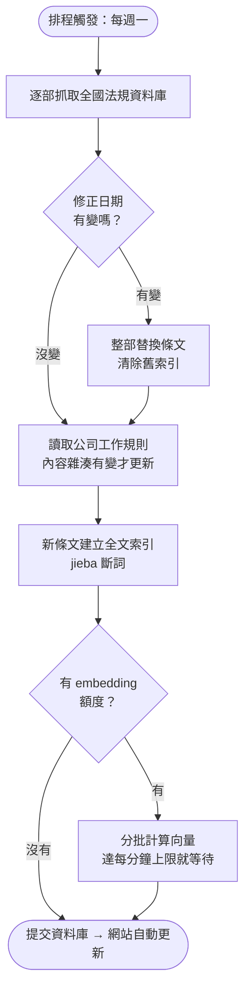
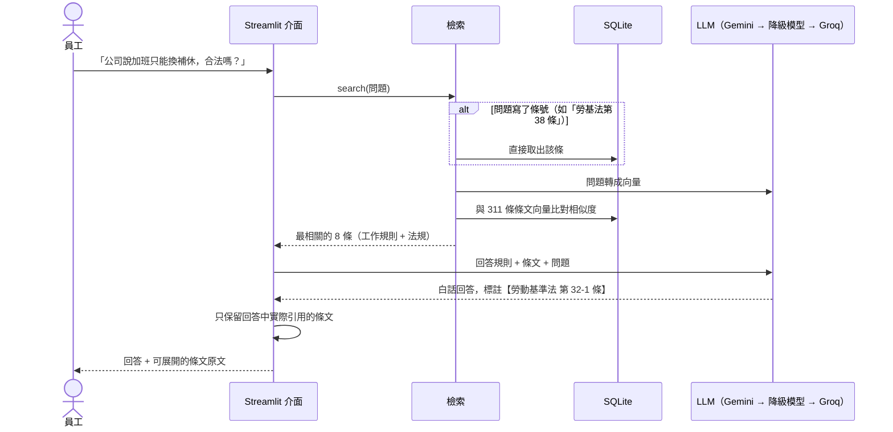

# 📘 規章與勞動法規問答助理

員工和主管用口語提問，例如「做滿一年可以放幾天特休？」「公司說加班只能換補休，合法嗎？」。
系統會從**公司工作規則**與**勞動法規**找出相關條文，用白話回答並附上出處；
遇到公司規章比法規更不利於員工時，會直接指出來。特休天數、加班費等有公式的問題，交給程式精確試算。

**線上展示：**（部署後補上）

> 本專案的公司工作規則為**虛構範例**（`data/handbook.md`）；法規來自[全國法規資料庫](https://law.moj.gov.tw/)。

## 解決什麼問題

### 沒有這個工具時

公司裡關於請假、加班、特休的問題，每天都在發生，而且大多是**重複的問題**：

| 誰 | 遇到的狀況 | 通常怎麼處理 | 問題在哪 |
|---|---|---|---|
| **員工** | 想知道特休剩幾天、家人住院能請什麼假、離職要提前多久講 | 翻員工手冊（找不到或看不懂），或直接問人資 | 手冊用語生硬；不好意思一直問；問同事得到的答案常常是錯的 |
| **人資／行政** | 每天被問同樣的問題 | 一個一個回答，遇到不確定的再去查法條 | 時間被切碎；不同人回答口徑不一；新人要花很久才熟悉法規 |
| **主管** | 部屬要請假或加班，要判斷能不能准、怎麼給 | 憑經驗判斷，或轉問人資 | 判斷錯誤可能讓公司違法（例如強制加班只能換補休） |
| **公司** | 工作規則多年沒有檢視 | 沒人發現某些條文已經跟不上修法 | 勞檢時才發現違法，面臨罰鍰 |

### 使用這個工具後

| 誰 | 怎麼用 | 效益 |
|---|---|---|
| **員工** | 直接用口語提問，幾秒拿到白話回答與條文出處 | 不用翻手冊、不用等人資回覆，隨時可查 |
| **人資／行政** | 常見問題請員工先問系統；自己查法條時也用它快速找到條號 | 重複問題減少，時間留給需要判斷的個案；回答口徑一致 |
| **主管** | 准假、排加班前先查一下規定；用「🧮 試算」算加班費 | 減少誤判，降低公司違法風險 |
| **公司** | 系統會主動指出工作規則與法規衝突之處 | 在勞檢之前先發現問題（範例中的第 7 條「加班一律補休」就會被指出違反勞基法第 32-1 條） |

> 以上是依一般企業人資作業推論的效益。實際導入時，應先統計人資每月被詢問的問題類型與次數，作為導入前後比較的基準。

## 功能

| 分頁 | 內容 |
|---|---|
| 💬 問答 | 口語提問 → 白話回答 + 引用條文（可展開看原文、連到全國法規資料庫）。查不到就直說，不會編造 |
| 🧮 試算 | 特別休假天數（勞基法第 38 條，列出每次取得特休的日期）、平日／休息日加班費（第 24 條） |
| 📚 條文查詢 | 依法規瀏覽、用關鍵字篩選條文 |
| 🗂️ 資料狀態 | 收錄的法規與版本（修正日期）、每次更新的執行紀錄 |

收錄範圍：勞動基準法、勞動基準法施行細則、勞工請假規則、性別平等工作法、勞工退休金條例，以及公司工作規則，共 311 條。

## 架構

### 資料更新流程（活動圖）



### 問答流程（循序圖）



## 檢索品質評估

RAG 的回答品質主要取決於檢索：條文沒被找到，LLM 再強也答不對。
我準備了 18 題**員工口語提問**，每題標註應該找到的條文（`data/eval_set.json`），比較不同檢索方式：

| 檢索方式 | 前 3 筆命中 | 前 8 筆命中 | MRR |
|---|---|---|---|
| 只用關鍵字（BM25） | 56% | 56% | 0.46 |
| 只用語意向量 | 100% | 100% | 0.97 |
| 混合（關鍵字 + 向量，RRF） | 83% | 89% | 0.72 |
| **本系統**（條號直達 + 向量，失敗時退回關鍵字） | **100%** | **100%** | **0.97** |

重現：`uv run python -m workrules eval`

**從評估得到的設計決策：**

1. **關鍵字檢索不適合員工的口語提問**：員工問「特休」，條文寫「特別休假」；問「資遣可以拿多少錢」，條文寫「資遣費由雇主按其工作年資…」。用詞對不上，就找不到
2. **原本採用的混合檢索被評估推翻**：混合檢索是業界常見的建議做法，但在這批資料上，關鍵字結果多半是雜訊，混進來反而把正確條文擠下去。實驗把關鍵字權重從 1.0 逐步降到 0，命中率一路上升，所以改成以向量為主
3. **關鍵字仍然保留**：問題直接寫出條號時直接取該條；向量服務額度用完時退回關鍵字檢索，確保系統不會完全無法使用

> 評估題目只有 18 題，規模不大；新增題目只要編輯 `data/eval_set.json`。

## 其他設計決策

| 決策 | 理由 |
|---|---|
| **一條條文一個檢索單位** | 法規本來就是以「條」組織，照條切比固定字數切更完整，引用時也能精確到條號 |
| **每條都帶上法規名稱與章名** | 條文常寫「前項規定…」，單看內容不知道出自哪部法規 |
| **試算交給程式，不交給 LLM** | LLM 擅長理解問題、解釋條文，但算數容易出錯；程式算的結果可以寫測試驗證。開發時測試就抓到一個邊界錯誤：8/31 到職，滿 6 個月應是 2/28（見[錯誤紀錄](docs/error-log.md)） |
| **工作規則不利於勞工時要明確指出** | 依勞基法第 1 條，雇主所訂勞動條件不得低於本法最低標準。這是公司導入內部問答工具時最有價值的副產品：主動發現規章問題 |
| **依修正日期決定是否重抓法規** | 法規很少修正，每次全部重抓浪費資源；修正時整部替換，避免逐條比對出錯 |
| **多模型、多供應商自動切換** | 使用免費 API，隨時可能遇到額度用完或服務忙碌 |
| **不另外架向量資料庫** | 條文只有 311 條，用 numpy 全部算一遍不到幾毫秒 |

## 快速開始

需要 [uv](https://docs.astral.sh/uv/)。

```bash
uv sync
cp .env.example .env                  # 填入 GEMINI_API_KEY（免費申請：https://aistudio.google.com/apikey）
uv run python -m workrules update     # 抓取法規、建立索引（首次約 4 分鐘，受免費額度限制）
uv run streamlit run app.py           # 開啟網頁介面
```

其他指令：

```bash
uv run python -m workrules ask "家人住院需要照顧，可以請什麼假？"
uv run python -m workrules eval       # 檢索品質評估
uv run python -m workrules status     # 收錄範圍與執行紀錄
uv run pytest                         # 單元測試
```

## 文件

- [操作說明](docs/operation.md)：給員工與主管
- [測試紀錄](docs/test-log.md)
- [錯誤紀錄](docs/error-log.md)：開發過程中遇到的問題與解法
- [交接文件](docs/handover.md)：專案結構、如何替換成貴公司的工作規則、如何新增法規

## 已知限制

- 只收錄 5 部法規；行政函釋、判決不在範圍內
- 回答僅供參考，不構成法律意見
- 免費 embedding 額度為每分鐘 100 筆，首次建立索引需分批等待
